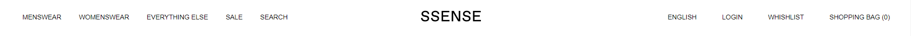
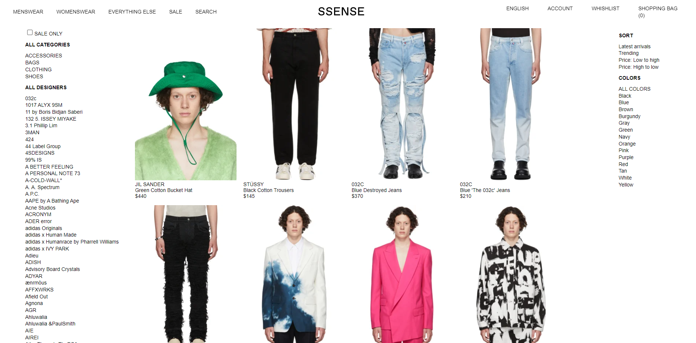
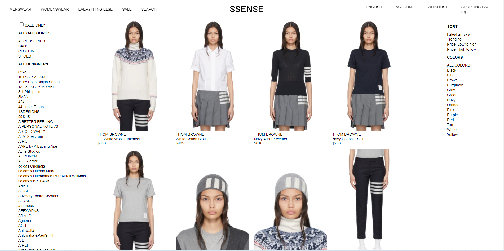
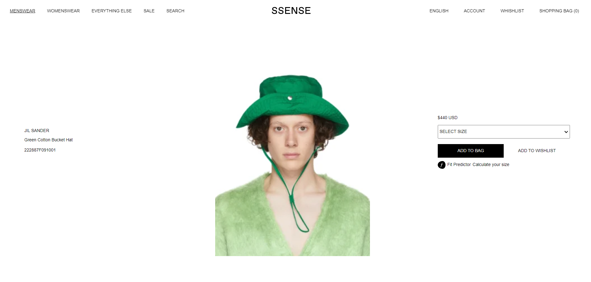
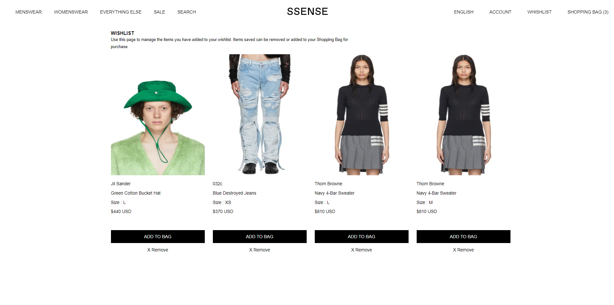
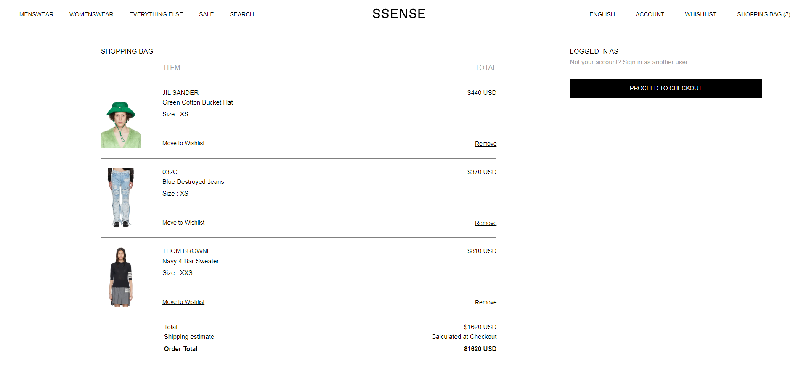
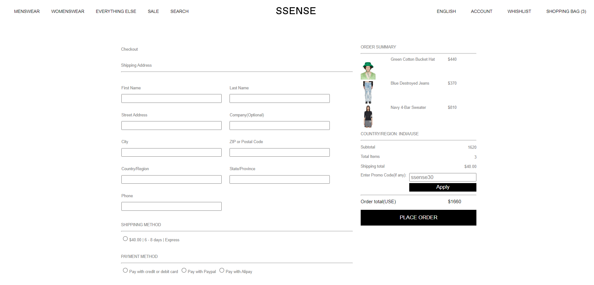
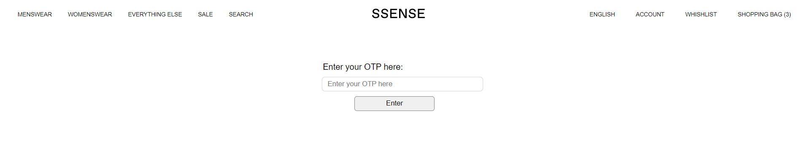

# What is SSENSE.com ?

SSENSE is a multi-brand retailer based in Montreal, Canada specialising in the sale of designer fashion and high end streetwear. It was founded as an e-commerce platform in 2003 by three brothers: Rami, Bassel and Firas Atallah. The company delivers to 114 countries around the world and operates websites in French, English, Japanese and Korean.

# About the Project.

Our team name is fab-three.
And this is a collabrative project, built in 5 days by a team of 3 members.

## Live project link

https://ssense-clones.netlify.app/

## Team members are

- [Abhijit Biswas ( Team lead )](https://github.com/abhijitnr)
- [Tushar Kadam](https://github.com/TusharKadam7671)
- [Priyanshu Lal](https://github.com/Siddharth263)

## Features implemented

- Signup
- Login
- Logout
- Filter by Category
- Sort by Price
- Add to Cart
- Remove from Cart
- Add to Wishlist
- Remove from wishlist
- Payment page with different methods
- Promo code
- Responsive ( suitable for mobile, tablet and desktop )

## All the pages of the clone website of ssense.com

- ## Navbar

  

- ## Home Page

  

- ## Signup and Login Page

  

- ## Menswear Page

  

- ## Womenswear Page

  

- ## Everything Else Page

  

- ## Product Preview Page

  

- ## Wishlist Page

  

- ## Cart Page

  

- ## Payment or Checkout Page

  

- ## Payment Confirm with OTP
  
